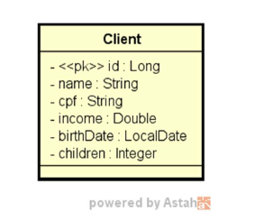
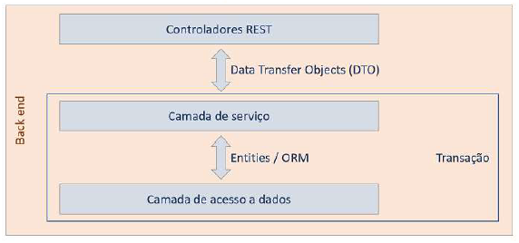

<h1 align="center"> Cliente </h1>

  <a href="#-tecnologias">Tecnologias</a>&nbsp;&nbsp;&nbsp;|&nbsp;&nbsp;&nbsp;
  <a href="#-projeto">Projeto</a>&nbsp;&nbsp;&nbsp;|&nbsp;&nbsp;&nbsp;

 

  

## 🚀 Tecnologias

Esse projeto foi desenvolvido com as seguintes tecnologias:

- Java
- Maven
- Spring Boot
- Spring Data JPA
- Hibernate
- Lombok
- Jakarta Bean Validation
- H2 Database
- Git e Github

  

## 💻 Projeto

É um projeto com ambiente de testes configurado acessando o banco de dados H2 e contém as quatros operações básicas realizadas em um banco
de dados relacionais que são consulta, inclusão, alteração e exclusão de um cliente, utilizando validações e tratamentos de exceções.